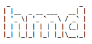
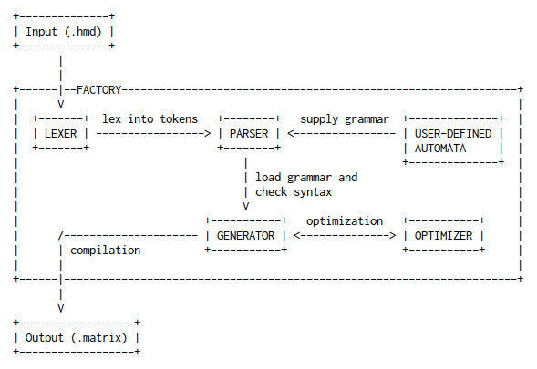
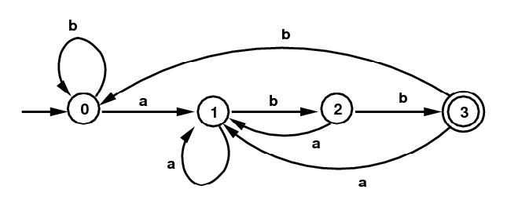

<p align="center">
  <a href="https://travis-ci.org/initbar/hmd">
    
  </a>
  <br>
  
</p>

**hmd** is the next-generation Hierarchial Multiple Dictionary (HMD) compiler, pattern matching, and text traversal engine. It's designed to be a monolith construct in order to provide a simpler interface during [import](https://docs.python.org/3/reference/import.html) as a module.

## Features

- Modular to support additional syntax and definitions.
- Backward-compatible with the older version **hmd_split.py**.
- Optimized to sort and de-duplicate listed keywords in results (".matrix").
- Optimized to sort and de-duplicate listed rules in results (".matrix").
- Convert dictionary terms into lemma using NLP engine.
- Check dictionary syntax during parsing stage.
- Support variables to store repeated strings.
- Syntax highlighting for definitions.
- Pack to single executable binary.
- Complete test suite.

## Usage

```bash
~$ make && cd ./build
~$ ./hmd -h
```

## Documentations

See [syntax](./docs/SYNTAX.md) or some [examples](./docs/EXAMPLE.md).

## Design

### i. Compiler

The modified compiler component has similarities to a conventional compiler. A text goes into `FACTORY` class, a singleton-wrapper instance that spawns and dies within the program's lifetime, and outputs as a matrix:



By default, `LEXER` will only tokenize a string into primitive characters, numbers, and symbols. If a user provides custom rules as a [regular expression](https://wikipedia.org/wiki/Regular_expression), it will use that instead.

Since the syntax of Hierarchial Multiple Dictionary (HMD) does not resemble that of a conventional programming language, custom language grammar was defined as inheritable abstractions of [deterministic finite automata](https://wikipedia.org/wiki/Deterministic_finite_automaton):



`PARSER` also uses similar technique as the [Shunting Yard algorithm](https://wikipedia.org/wiki/Shunting-yard_algorithm) to split the operator and scalar values. However, it has heavily modified the algorithm to accomodate variables and comments:


`GENERATOR` is an overridable class that can be defined with custom compiling implementations. By itself, it's an empty class.

### ii. Pattern Matching and Text Traversal Engine

TODO

## License

**hmd** is under [MIT License](./LICENSE.md).
