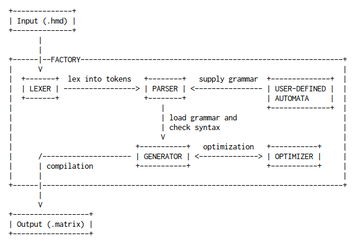
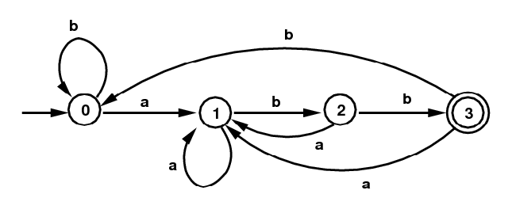

# Design

There are two major components to the **hmd** code: compiler and matcher:

## i. Compiler

The modified compiler component has similarities to a conventional compiler. A text goes into `FACTORY` class, a singleton-wrapper instance that spawns and dies within the program's lifetime, and outputs as a matrix:

By default, `LEXER` will only tokenize a string into primitive characters, numbers, and symbols. If a user provides custom rules as a [regular expression](https://wikipedia.org/wiki/Regular_expression), it will use that instead.

Since the syntax of Hierarchial Multiple Dictionary (HMD) does not resemble that of a conventional programming language, custom language grammar was defined as inheritable abstractions of [deterministic finite automata](https://wikipedia.org/wiki/Deterministic_finite_automaton):

`PARSER` also uses similar technique as the [Shunting Yard algorithm](https://wikipedia.org/wiki/Shunting-yard_algorithm) to split the operator and scalar values. However, it has heavily modified the algorithm to accomodate variables and comments:

`GENERATOR` is an overridable class that can be defined with custom compiling implementations. By itself, it's an empty class.

## ii. Pattern Matching and Text Traversal Engine

TODO
